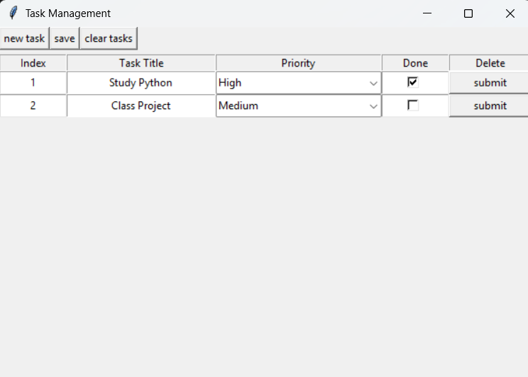

# 📝 Daily Task Todo List

A minimalist GUI-based **Task Management System** built with Python and Tkinter, featuring full CRUD operations and persistent local storage (CSV).  
Lightweight, dependency-free, and designed for **daily productivity**.


## 🧩 Architecture


``` 
daily-task-todo-list/

│

├── src/

│ ├── main.py # Core logic & CLI operations

│ ├── ui.py # Tkinter graphical interface

│ └── todo.csv # Local storage file

│

├── assets/

│ └── screenshot.png # GUI preview (optional)

│

├── README.md

└── requirements.txt
```


## ⚙️ Features

- ✅ Create, Read, Update, Delete (CRUD) operations
- 🗃️ Persistent local CSV storage
- 🖥️ Interactive Tkinter GUI
- 🔢 Command-Line Interface (CLI) mode
- 🎯 Lightweight, dependency-free design


## 🚀 Usage

### 1️⃣ Run GUI version
```bash
cd src
python ui.py
```

### 2️⃣ Run CLI version

```bash
cd src

# Create a new task
python main.py create "Study AI" High

# List all tasks
python main.py list

# Update a task
python main.py update "Study AI" done 1

# Delete a task
python main.py delete "Study AI"
```

## 🧱 Example GUI Layout




---
**Author:** Shantiya  
**License:** MIT  
**GitHub:** [github.com/ShantiyaShamushaki](https://github.com/ShantiyaShamushaki)


